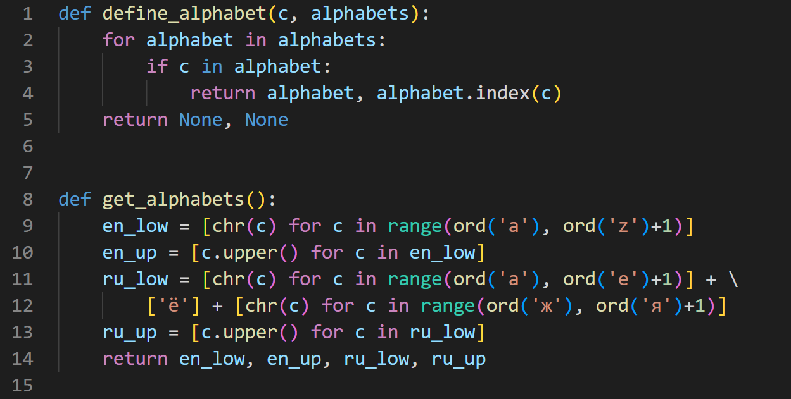
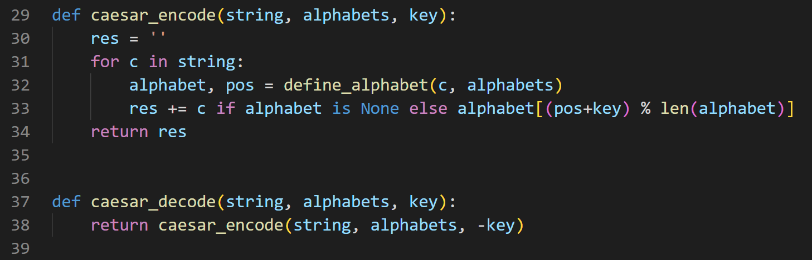
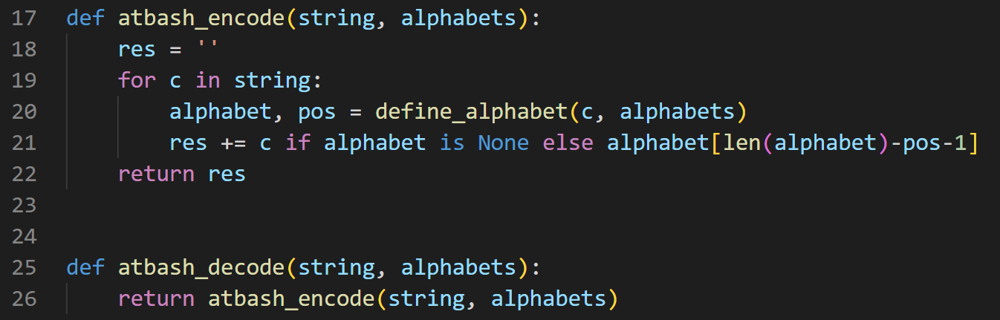

---
## Front matter
lang: ru-RU
title: "Лабораторная работа 1"
subtitle: "Шифры простой замены" 
author: "Пологов Владислав Александрович"
institute: RUDN University, Moscow, Russian Federation
date: 2022 Москва

## Formatting
mainfont: PT Serif
romanfont: PT Serif
sansfont: PT Serif
monofont: PT Serif
toc: false
slide_level: 2
theme: metropolis
header-includes: 
 - \metroset{progressbar=frametitle,sectionpage=progressbar,numbering=fraction}
 - '\makeatletter'
 - '\beamer@ignorenonframefalse'
 - '\makeatother'
aspectratio: 43
section-titles: true
---

# Цель работы 

## Цель работы

Реализовать шифр Цезаря с произвольным ключом _k_.

Реализовать шифр Атбаш.

# Описание реализации

## Описание реализации

Для реализации алгоритмов использовались средства языка Python. 

Сгенерированы английский и русские алфавиты. (рис. -@fig:001)

Были реализованы как шифраторы, так и дешифраторы рассматриваемых алгоритмов.

## Описание реализации

{ #fig:001 width=100% }

# Реализация 

## Шифр Цезаря с произвольным ключом k

Шифр Цезаря — это вид шифра подстановки, в котором каждый символ в открытом тексте заменяется символом, находящимся на некотором постоянном числе позиций левее или правее него в алфавите. (рис. -@fig:002)

## Шифр Цезаря с произвольным ключом k

Если сопоставить каждому символу алфавита его порядковый номер (нумеруя с 0), то шифрование и дешифрование можно выразить формулами модульной арифметики:

$$y=(x+k) mod (n)$$
$$x=(y-k) mod (n)$$

где $x$ — символ открытого текста, $y$ — символ шифрованного текста, $n$ — мощность алфавита, а $k$ — ключ.

## Шифр Цезаря с произвольным ключом k

{ #fig:002 width=100% }

## Шифр Атбаш

Шифр Атбаш — простой шифр подстановки для алфавитного письма. Правило шифрования состоит в замене $i$-й буквы алфавита буквой с номером $n-i+1$, где $n$ — число букв в алфавите. (рис. -@fig:003)

## Шифр Атбаш

{ #fig:003 width=100% }

# Вывод 

## Вывод 

Реализовали шифр Цезаря с произвольным ключом _k_.

Реализовали шифр Атбаш.

## {.standout}