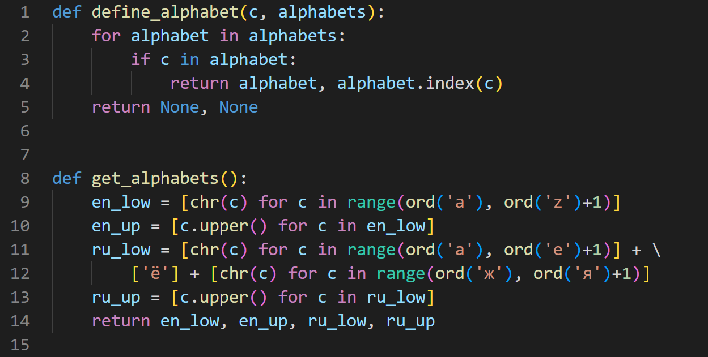
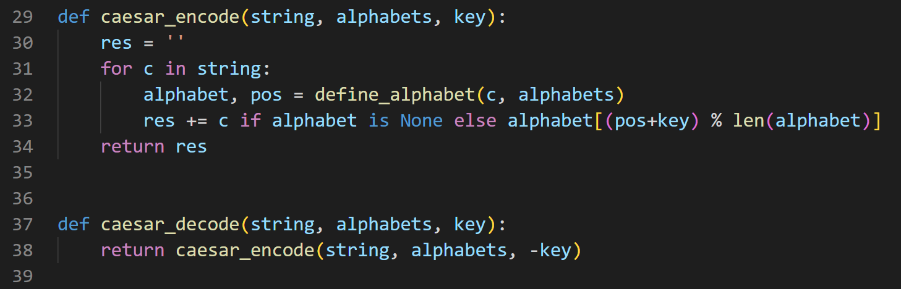
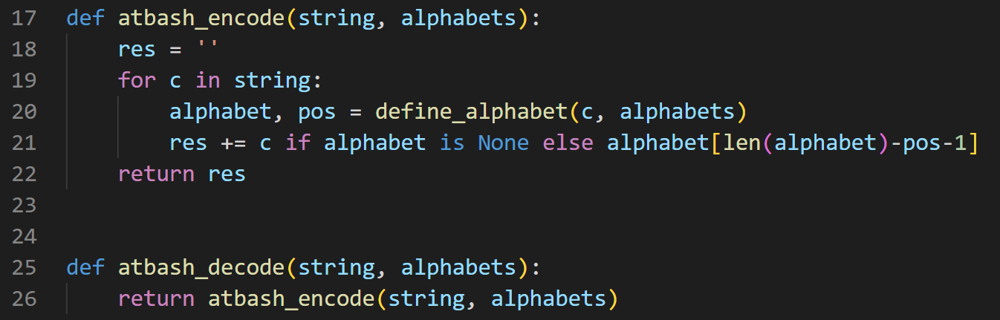

---
# Front matter
lang: ru-RU
title: "Лабораторная работа 2"
subtitle: "Шифры перестановки" 
author: "Пологов Владислав Александрович"

# Formatting
toc-title: "Содержание"
toc: true # Table of contents
toc_depth: 2
lof: true # List of figures
lot: false # List of tables
fontsize: 12pt
linestretch: 1.5
papersize: a4paper
documentclass: scrreprt
polyglossia-lang: russian
polyglossia-otherlangs: english
mainfont: PT Serif
romanfont: PT Serif
sansfont: PT Serif
monofont: PT Serif
mainfontoptions: Ligatures=TeX
romanfontoptions: Ligatures=TeX
sansfontoptions: Ligatures=TeX,Scale=MatchLowercase
monofontoptions: Scale=MatchLowercase
indent: true
pdf-engine: lualatex
header-includes:
  - \linepenalty=10 # the penalty added to the badness of each line within a paragraph (no associated penalty node) Increasing the value makes tex try to have fewer lines in the paragraph.
  - \interlinepenalty=0 # value of the penalty (node) added after each line of a paragraph.
  - \hyphenpenalty=50 # the penalty for line breaking at an automatically inserted hyphen
  - \exhyphenpenalty=50 # the penalty for line breaking at an explicit hyphen
  - \binoppenalty=700 # the penalty for breaking a line at a binary operator
  - \relpenalty=500 # the penalty for breaking a line at a relation
  - \clubpenalty=150 # extra penalty for breaking after first line of a paragraph
  - \widowpenalty=150 # extra penalty for breaking before last line of a paragraph
  - \displaywidowpenalty=50 # extra penalty for breaking before last line before a display math
  - \brokenpenalty=100 # extra penalty for page breaking after a hyphenated line
  - \predisplaypenalty=10000 # penalty for breaking before a display
  - \postdisplaypenalty=0 # penalty for breaking after a display
  - \floatingpenalty = 20000 # penalty for splitting an insertion (can only be split footnote in standard LaTeX)
  - \raggedbottom # or \flushbottom
  - \usepackage{float} # keep figures where there are in the text
  - \floatplacement{figure}{H} # keep figures where there are in the text
---

# Цель работы 

Реализовать метод маршрутного шифрования.

Реализовать метод шифрования с помощью решёток.

Реализовать метод шифрования с помощью таблицы Виженера.

# Описание реализации

Для реализации алгоритмов использовались средства языка Python. 

Были сгенерированы анлийский и русский алфавиты. (рис. -@fig:001)

Были реализованы как шифраторы, так и дешифраторы рассматриваемых алгоритмов.

{ #fig:001 width=100% }

# Реализация 

## Шифр Цезаря с произвольным ключом k

Шифр Цезаря — это вид шифра подстановки, в котором каждый символ в открытом тексте заменяется символом, находящимся на некотором постоянном числе позиций левее или правее него в алфавите. (рис. -@fig:002)

Если сопоставить каждому символу алфавита его порядковый номер (нумеруя с 0), то шифрование и дешифрование можно выразить формулами модульной арифметики:

$$y=(x+k) mod (n)$$
$$x=(y-k) mod (n)$$

где $x$ — символ открытого текста, $y$ — символ шифрованного текста, $n$ — мощность алфавита, а $k$ — ключ.

{ #fig:002 width=100% }

## Шифр Атбаш

Шифр Атбаш — простой шифр подстановки для алфавитного письма. Правило шифрования состоит в замене $i$-й буквы алфавита буквой с номером $n-i+1$, где $n$ — число букв в алфавите. (рис. -@fig:003)

{ #fig:003 width=100% }

# Вывод 

Реализовали шифр Цезаря с произвольным ключом _k_.

Реализовали шифр Атбаш.