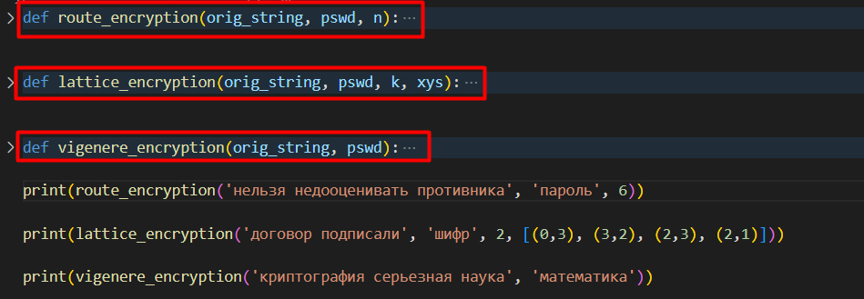
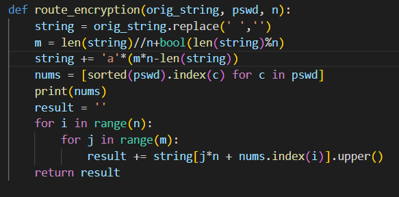
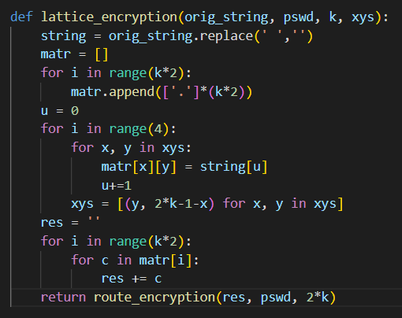
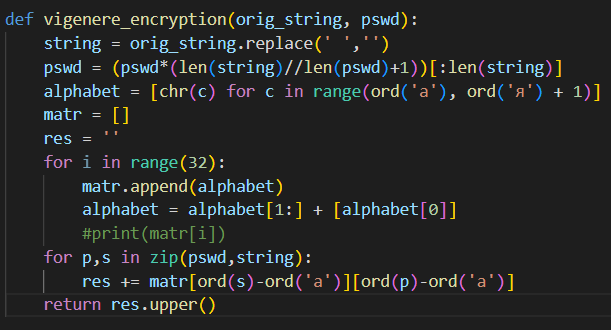

---
## Front matter
lang: ru-RU
title: "Лабораторная работа 2"
subtitle: "Шифры перестановки" 
author: "Пологов Владислав Александрович"
institute: RUDN University, Moscow, Russian Federation
date: 2022 Москва

## Formatting
mainfont: PT Serif
romanfont: PT Serif
sansfont: PT Serif
monofont: PT Serif
toc: false
slide_level: 2
theme: metropolis
header-includes: 
 - \metroset{progressbar=frametitle,sectionpage=progressbar,numbering=fraction}
 - '\makeatletter'
 - '\beamer@ignorenonframefalse'
 - '\makeatother'
aspectratio: 43
section-titles: true
---

# Цель работы 

## Цель работы

Реализовать метод маршрутного шифрования.

Реализовать метод шифрования с помощью решёток.

Реализовать метод шифрования с помощью таблицы Виженера.

# Описание реализации

## Описание реализации

Для реализации алгоритмов использовались средства языка Python. 

Каждый метод был реализован отдельной функцией с соответствующим названием. (рис. -@fig:001)

Каждая функция принимала в качестве входных параметров строку и пароль для её шифрования. Помимо этого в методе машрутного шифрования необходимо было сообщать функции о длине блока n. А в методе шифрования с помощью решёток на вход ещё подавались сторона изначального квадрата k и координаты прорезей решётки.

## Описание реализации

{ #fig:001 width=100% }

# Реализация 

## Маршрутное шифрование

Данный способ шифрования разработал фанцунзский математик Франсуа Виет. Его суть заключалась в записи исходного текста в некоторую геометрическую форму(обычно прямоугольник) по некоторому пути, а затем, выписывая символы по другому пути, можно было получить шифртекст. (рис.-@fig:002)

## Маршрутное шифрование

В данном способе можно обойтись без составления матрицы. Доступ к строке и её шифрования осуществлялось следующим образом:

$$j*n + nums.index(i)$$

где $j$ — номер строки, $n$ — длина одного модуля или количество столбцов, $nums.index(i)$ — функция, вовзращающая индекс буквы пароля в соответствие с алфавитным порядком.

## ШМаршрутное шифрование

{ #fig:002 width=100% }

## Шифрование с помощью решёток

Данный способ шифрования предложил австрийский криптограф Эдуард Флейснер в 1881 году. Суть заключается в том, что строится матрица размерности 2*k. Далее в матрице вырезаются клетки, содержащие числа от 1 до $k^2$. Получается решето, которое мы накладываем на наш исходный текст. Алгоритм является иттерационнным и каждая иттерация сопровождается поворотом решётки на 90 градусов. Число $k$ выбирается в соответствии с количеством букв исходного текста. (рис. -@fig:003)

## Шифрование с помощью решёток

{ #fig:003 width=100% }

## Шифрование с помощью таблицы Виженера

Суть этого метода заключается в том, что имеется таблица, составленная при помощи циклического сдвига букв русского алфавита на одну позицию влево. Для составления шифра используется пароль, который продлевается до конца исходной строки. После, в соответствии с паролем, находится буква в таблице Виженера для шифрования соответствующей буквы исходного текста. (рис. -@fig:004)

## Шифрование с помощью таблицы Виженера

{ #fig:004 width=100% }

# Вывод 

## Вывод 

Ознакомились с шифрами перестановок.

Реализовали метод маршрутного шифрования.

Реализовали метод шифрования с помощтю решёток.

Реализовали метод шифрования с помощью таблицы Виженера.

## {.standout}