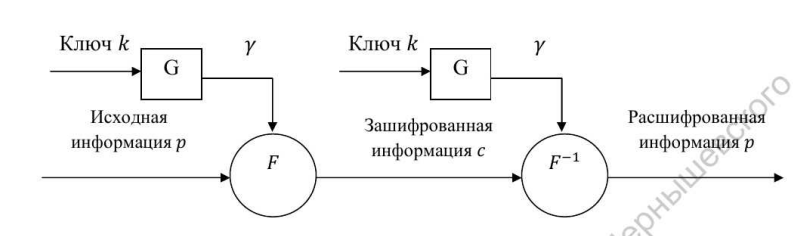
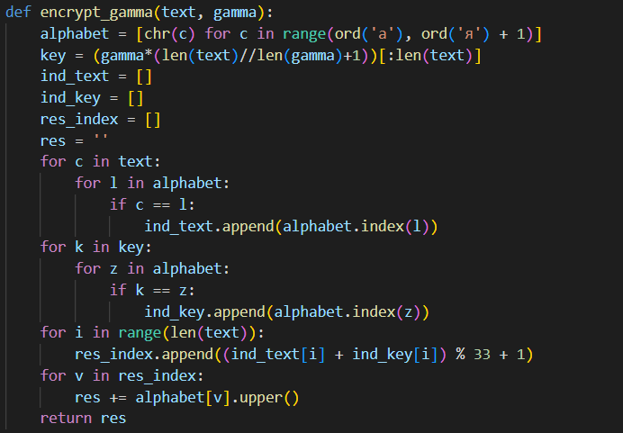
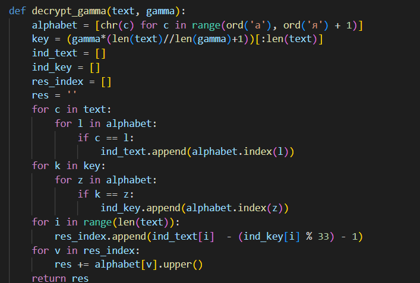

---
## Front matter
lang: ru-RU
title: "Лабораторная работа 3"
subtitle: "Шифрование гаммированием" 
author: "Пологов Владислав Александрович"
institute: RUDN University, Moscow, Russian Federation
date: 2022 Москва

## Formatting
mainfont: PT Serif
romanfont: PT Serif
sansfont: PT Serif
monofont: PT Serif
toc: false
slide_level: 2
theme: metropolis
header-includes: 
 - \metroset{progressbar=frametitle,sectionpage=progressbar,numbering=fraction}
 - '\makeatletter'
 - '\beamer@ignorenonframefalse'
 - '\makeatother'
aspectratio: 43
section-titles: true
---

# Цель работы 

## Цель работы

Реализовать алгоритм шифрования гаммированием конечной гаммой.

# Описание реализации

## Описание реализации

Для реализации алгоритмов использовались средства языка Python. 

Были реализованы как шифратор, так и дешифратор реализуемого алгоритма. (рис. -@fig:001)

## Описание реализации

{ #fig:001 width=100% }

# Реализация 

## Шифрование гаммированием

Гаммирование - процедура наложения при помощи некоторой функции F на исходный текст гаммы шифра, то.е. псевдослучайной последовательности (ПСП) с выходов генератора G. Псевдослучайная последовательность является детерминированной, т.е. известен алгоритм её формирования. (рис. -@fig:002)

$$\gamma_i=\alpha*\gamma_{i-1} + b*mod(m), i = 1, m$$

где $\gamma_i$ — i-й член последовательности псведослучайных чисел, $\alpha, \gamma_0, b$ — ключевые параметры.

## Шифрование гаммированием

{ #fig:002 width=100% }

## Условия достижения максимальной длины периода m

ПСП является периодической. Знание периода гаммы суещственно облегчает криптоанализ. Максимальная длина периода равна m. Для её достижения необходимо удовлетворить следующим условиям:

1. b и m - взаимно простые числа;

2. a - 1 делится на любой простой делитель числа m;

3. a - 1 кратно 4, если m кратно 4.

## Код реализации шифрования гаммированием

Для реализации были использованы функции получения алфавита и продления ключа до длины исходной строки из предыдущих лабораторных. (рис. -@fig:003)

## Код реализации шифрования гаммированием

{ #fig:003 width=100% }

## Код дешифратора

Дешифрация отличается лишь формулой получения индекса элемента. (рис. -@fig:004)

## Код дешифратора

{ #fig:004 width=100% }

# Вывод 

## Вывод 

* Реализовали алгоритм шифрования гаммированием конечной гаммой.

* Узнали алгоритм формирования псевдослучайной последовательноати.

## {.standout}