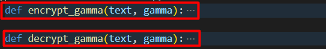
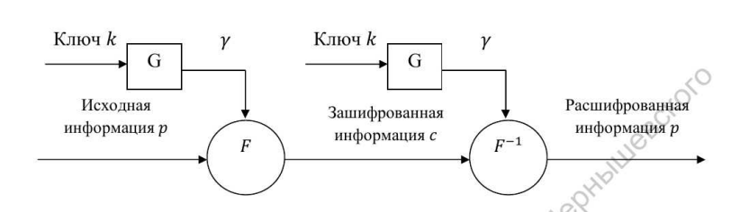
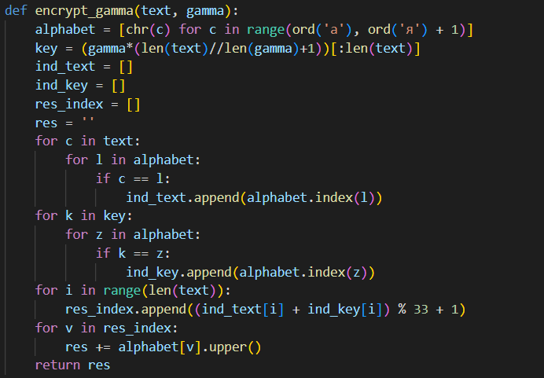
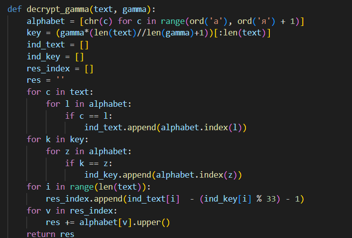

---
# Front matter
lang: ru-RU
title: "Лабораторная работа 3"
subtitle: "Шифрование гаммированием" 
author: "Пологов Владислав Александрович"

# Formatting
toc-title: "Содержание"
toc: true # Table of contents
toc_depth: 2
lof: true # List of figures
lot: false # List of tables
fontsize: 12pt
linestretch: 1.5
papersize: a4paper
documentclass: scrreprt
polyglossia-lang: russian
polyglossia-otherlangs: english
mainfont: PT Serif
romanfont: PT Serif
sansfont: PT Serif
monofont: PT Serif
mainfontoptions: Ligatures=TeX
romanfontoptions: Ligatures=TeX
sansfontoptions: Ligatures=TeX,Scale=MatchLowercase
monofontoptions: Scale=MatchLowercase
indent: true
pdf-engine: lualatex
header-includes:
  - \linepenalty=10 # the penalty added to the badness of each line within a paragraph (no associated penalty node) Increasing the value makes tex try to have fewer lines in the paragraph.
  - \interlinepenalty=0 # value of the penalty (node) added after each line of a paragraph.
  - \hyphenpenalty=50 # the penalty for line breaking at an automatically inserted hyphen
  - \exhyphenpenalty=50 # the penalty for line breaking at an explicit hyphen
  - \binoppenalty=700 # the penalty for breaking a line at a binary operator
  - \relpenalty=500 # the penalty for breaking a line at a relation
  - \clubpenalty=150 # extra penalty for breaking after first line of a paragraph
  - \widowpenalty=150 # extra penalty for breaking before last line of a paragraph
  - \displaywidowpenalty=50 # extra penalty for breaking before last line before a display math
  - \brokenpenalty=100 # extra penalty for page breaking after a hyphenated line
  - \predisplaypenalty=10000 # penalty for breaking before a display
  - \postdisplaypenalty=0 # penalty for breaking after a display
  - \floatingpenalty = 20000 # penalty for splitting an insertion (can only be split footnote in standard LaTeX)
  - \raggedbottom # or \flushbottom
  - \usepackage{float} # keep figures where there are in the text
  - \floatplacement{figure}{H} # keep figures where there are in the text
---

# Цель работы 

Реализовать алгоритм шифрования гаммированием конечной гаммой.

# Описание реализации

Для реализации алгоритмов использовались средства языка Python. 

Были реализованы как шифратор, так и дешифратор реализуемого алгоритма. (рис. -@fig:001)

{ #fig:001 width=100% }

# Реализация 

## Шифрование гаммированием

Гаммирование - процедура наложения при помощи некоторой функции F на исходный текст гаммы шифра, то.е. псевдослучайной последовательности (ПСП) с выходов генератора G. Псевдослучайная последовательность является детерминированной, т.е. известен алгоритм её формирования. (рис. -@fig:002)

$$\gamma_i=\alpha*\gamma_{i-1} + b*mod(m), i = 1, m$$

где $\gamma_i$ — i-й член последовательности псведослучайных чисел, $\alpha, \gamma_0, b$ — ключевые параметры.

{ #fig:002 width=100% }

## Условия достижения максимальной длины периода m

ПСП является периодической. Знание периода гаммы суещственно облегчает криптоанализ. Максимальная длина периода равна m. Для её достижения необходимо удовлетворить следующим условиям:

1. b и m - взаимно простые числа;

2. a - 1 делится на любой простой делитель числа m;

3. a - 1 кратно 4, если m кратно 4.

## Код реализации шифрования гаммированием

Для реализации были использованы функции получения алфавита и продления ключа до длины исходной строки из предыдущих лабораторных. (рис. -@fig:003)

## Код реализации шифрования гаммированием

{ #fig:003 width=100% }

## Код дешифратора

Дешифрация отличается лишь формулой получения индекса элемента. (рис. -@fig:004)

## Код дешифратора

{ #fig:004 width=100% }

# Вывод 

* Реализовали алгоритм шифрования гаммированием конечной гаммой.

* Узнали алгоритм формирования псевдослучайной последовательноати.