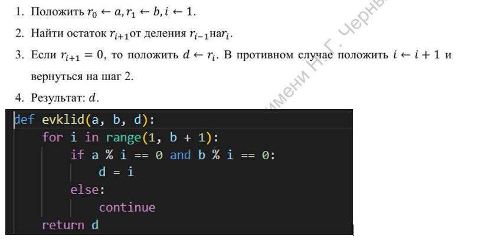
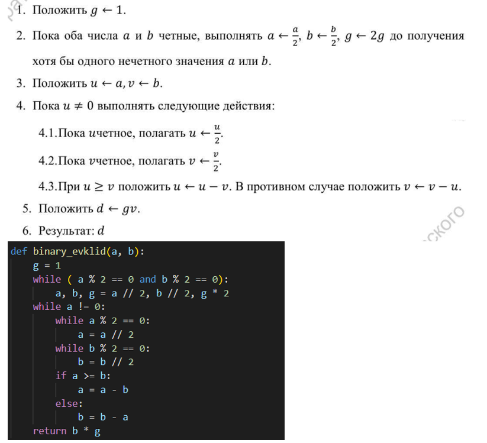
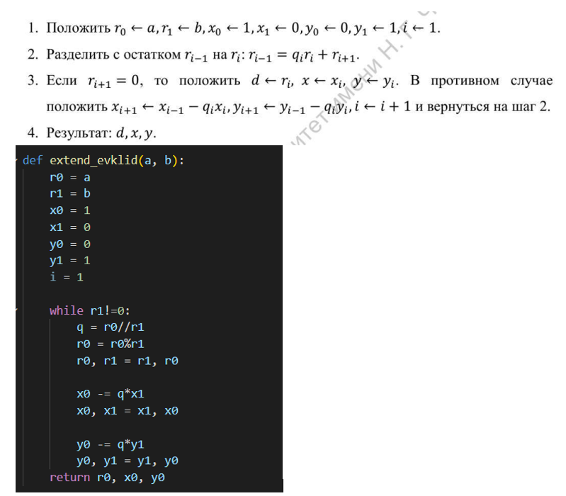
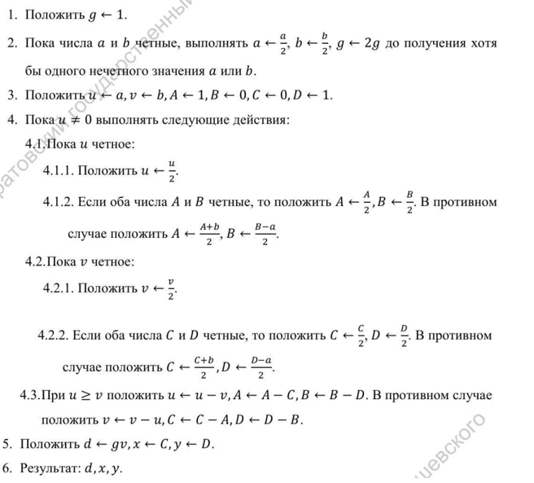
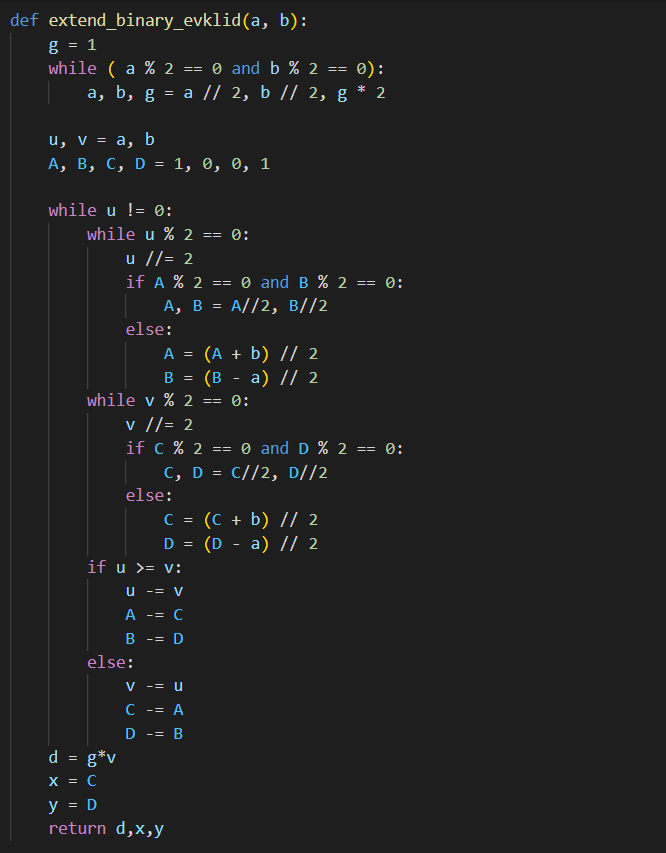

---
## Front matter
lang: ru-RU
title: "Лабораторная работа 4"
subtitle: "Вычисление наибольшего общего делителя" 
author: "Пологов Владислав Александрович"
institute: RUDN University, Moscow, Russian Federation
date: 2022 Москва

## Formatting
mainfont: PT Serif
romanfont: PT Serif
sansfont: PT Serif
monofont: PT Serif
toc: false
slide_level: 2
theme: metropolis
header-includes: 
 - \metroset{progressbar=frametitle,sectionpage=progressbar,numbering=fraction}
 - '\makeatletter'
 - '\beamer@ignorenonframefalse'
 - '\makeatother'
aspectratio: 43
section-titles: true
---

# Цель работы 

## Цель работы

Реализовать алгоритмы вычисления наибольшего общего делителя:

    1. Алгоритм Евклида
    2. Бинарный Алгоритм Евклида
    3. Расширенный алгоритм Евклида
    4. Расширенный бинарный алгоритм Евклида

# Описание реализации

## Описание реализации

Для реализации алгоритмов использовались средства языка Python. 

# Реализация 

## Алгоритм Евклида

На вход мы подаём два целых числа a и b. На выходе получаем d - НОД.
Алгоиртм Евклида и его реализация на Python приведёны на рисунке 1. (рис. -@fig:001)

## Алгоритм Евклида

{ #fig:001 width=100% }

## Бинарный алгоритм Евклида

Для реализации бинарного алгоритма Евклида использовалась дополнительная переменная g.
Данный алгоритм и его реализация на Python представлены на рисунке 2. (рис. -@fig:002)

## Бинарный алгоритм Евклида

{ #fig:002 width=100% }

## Расширенный алгоритм Евклида

В расширенном алгоритме Евклида также необходимо соблюдение следующего условия:
    $$a * x + b * y = d$$
Расширенный алгоритм Евклида и его реализация на Python представлены на рисунке 3. (рис. -@fig:003)

## Расширенный алгоритм Евклида

{ #fig:003 width=100% }

## Расширенный бинарный алгоритм Евклида

В расширенном бинарном алгоритме Евклида сочетатся методы используемые в расширенном и бинарном алгоритмах.

Расширенный бинарный алгоритм Евклида представлен на рисунке 4. (рис. -@fig:004)

Код расширенного бинарного алгоритма Евклида представлен на рисунке 5. (рис. -@fig:005)

## Расширенный бинарный алгоритм Евклида

{ #fig:004 width=100% }

## Расширенный бинарный алгоритм Евклида

{ #fig:005 width=100% }

# Вывод 

## Вывод 

* Реализовали следующие алгоритмы для нахождения НОД:
    1. Алгоритм Евклида
    2. Бинарный Алгоритм Евклида
    3. Расширенный алгоритм Евклида
    4. Расширенный бинарный алгоритм Евклида.

## {.standout}