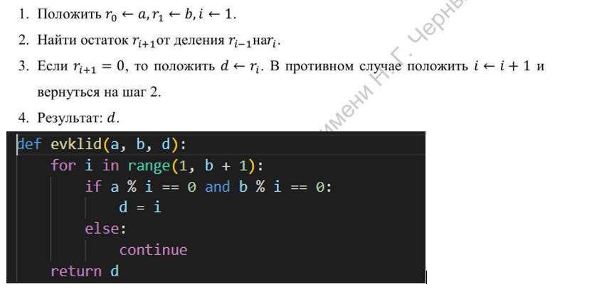
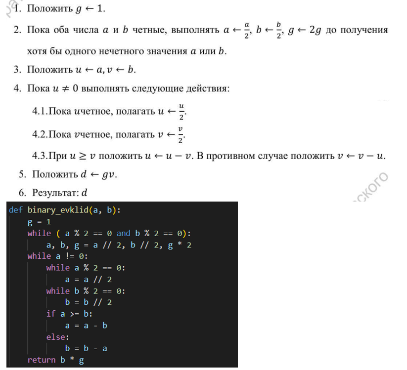
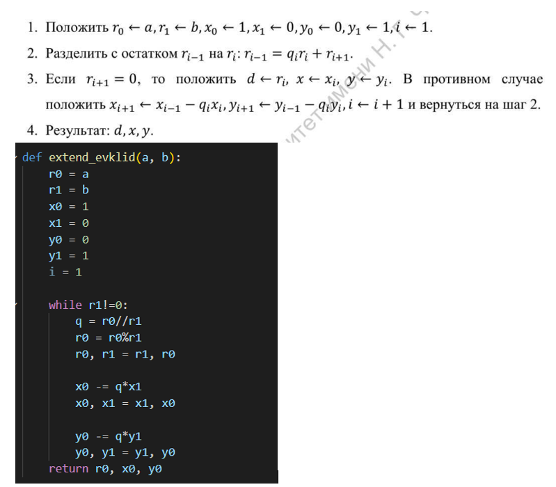
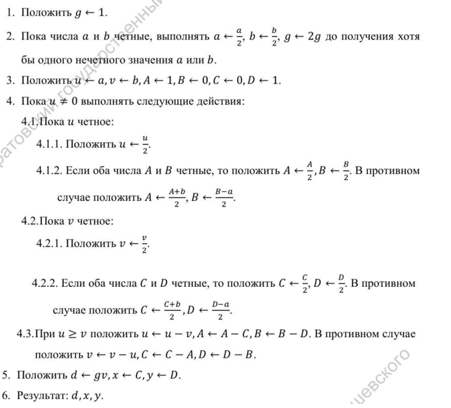
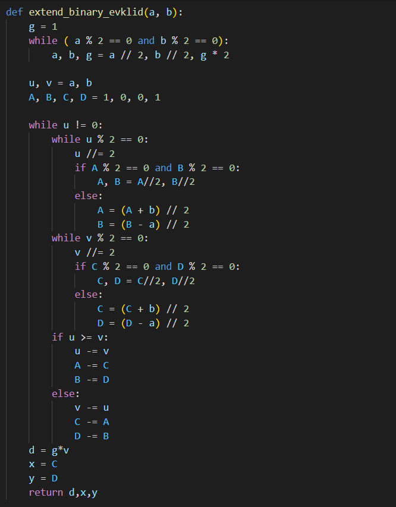

---
# Front matter
lang: ru-RU
title: "Лабораторная работа 4"
subtitle: "Вычисление наибольшего общего делителя" 
author: "Пологов Владислав Александрович"

# Formatting
toc-title: "Содержание"
toc: true # Table of contents
toc_depth: 2
lof: true # List of figures
lot: false # List of tables
fontsize: 12pt
linestretch: 1.5
papersize: a4paper
documentclass: scrreprt
polyglossia-lang: russian
polyglossia-otherlangs: english
mainfont: PT Serif
romanfont: PT Serif
sansfont: PT Serif
monofont: PT Serif
mainfontoptions: Ligatures=TeX
romanfontoptions: Ligatures=TeX
sansfontoptions: Ligatures=TeX,Scale=MatchLowercase
monofontoptions: Scale=MatchLowercase
indent: true
pdf-engine: lualatex
header-includes:
  - \linepenalty=10 # the penalty added to the badness of each line within a paragraph (no associated penalty node) Increasing the value makes tex try to have fewer lines in the paragraph.
  - \interlinepenalty=0 # value of the penalty (node) added after each line of a paragraph.
  - \hyphenpenalty=50 # the penalty for line breaking at an automatically inserted hyphen
  - \exhyphenpenalty=50 # the penalty for line breaking at an explicit hyphen
  - \binoppenalty=700 # the penalty for breaking a line at a binary operator
  - \relpenalty=500 # the penalty for breaking a line at a relation
  - \clubpenalty=150 # extra penalty for breaking after first line of a paragraph
  - \widowpenalty=150 # extra penalty for breaking before last line of a paragraph
  - \displaywidowpenalty=50 # extra penalty for breaking before last line before a display math
  - \brokenpenalty=100 # extra penalty for page breaking after a hyphenated line
  - \predisplaypenalty=10000 # penalty for breaking before a display
  - \postdisplaypenalty=0 # penalty for breaking after a display
  - \floatingpenalty = 20000 # penalty for splitting an insertion (can only be split footnote in standard LaTeX)
  - \raggedbottom # or \flushbottom
  - \usepackage{float} # keep figures where there are in the text
  - \floatplacement{figure}{H} # keep figures where there are in the text
---

# Цель работы 

Реализовать алгоритмы вычисления наибольшего общего делителя:

    1. Алгоритм Евклида
    2. Бинарный Алгоритм Евклида
    3. Расширенный алгоритм Евклида
    4. Расширенный бинарный алгоритм Евклида

# Описание реализации

Для реализации алгоритмов использовались средства языка Python. 

# Реализация 

## Алгоритм Евклида

На вход мы подаём два целых числа a и b. На выходе получаем d - НОД.
Алгоиртм Евклида и его реализация на Python приведёны на рисунке 1. (рис. -@fig:001)

## Алгоритм Евклида

{ #fig:001 width=100% }

## Бинарный алгоритм Евклида

Для реализации бинарного алгоритма Евклида использовалась дополнительная переменная g.
Данный алгоритм и его реализация на Python представлены на рисунке 2. (рис. -@fig:002)

## Бинарный алгоритм Евклида

{ #fig:002 width=100% }

## Расширенный алгоритм Евклида

В расширенном алгоритме Евклида также необходимо соблюдение следующего условия:
    $$a * x + b * y = d$$
Расширенный алгоритм Евклида и его реализация на Python представлены на рисунке 3. (рис. -@fig:003)

## Расширенный алгоритм Евклида

{ #fig:003 width=100% }

## Расширенный бинарный алгоритм Евклида

В расширенном бинарном алгоритме Евклида сочетатся методы используемые в расширенном и бинарном алгоритмах.

Расширенный бинарный алгоритм Евклида представлен на рисунке 4. (рис. -@fig:004)

Код расширенного бинарного алгоритма Евклида представлен на рисунке 5. (рис. -@fig:005)

## Расширенный бинарный алгоритм Евклида

{ #fig:004 width=100% }

## Расширенный бинарный алгоритм Евклида

{ #fig:005 width=100% }

# Вывод 

* Реализовали следующие алгоритмы для нахождения НОД:
    1. Алгоритм Евклида
    2. Бинарный Алгоритм Евклида
    3. Расширенный алгоритм Евклида
    4. Расширенный бинарный алгоритм Евклида.