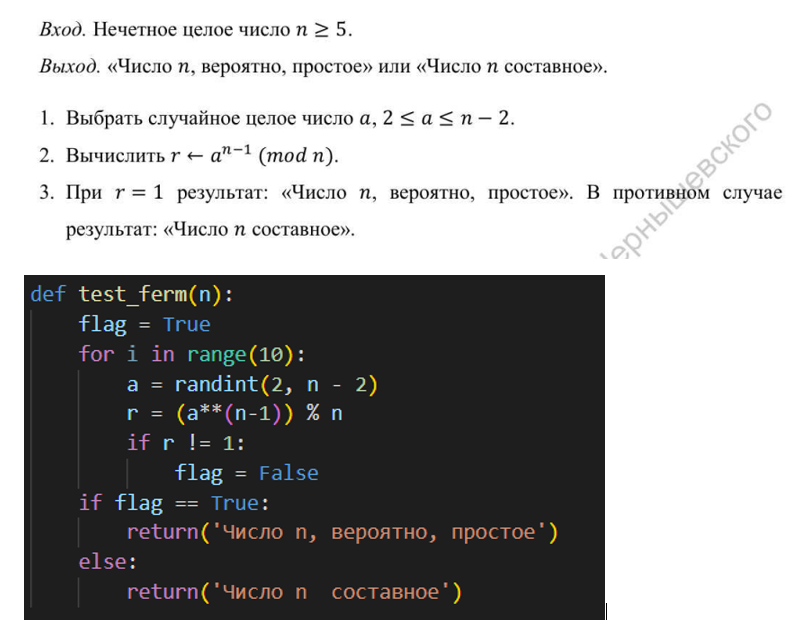
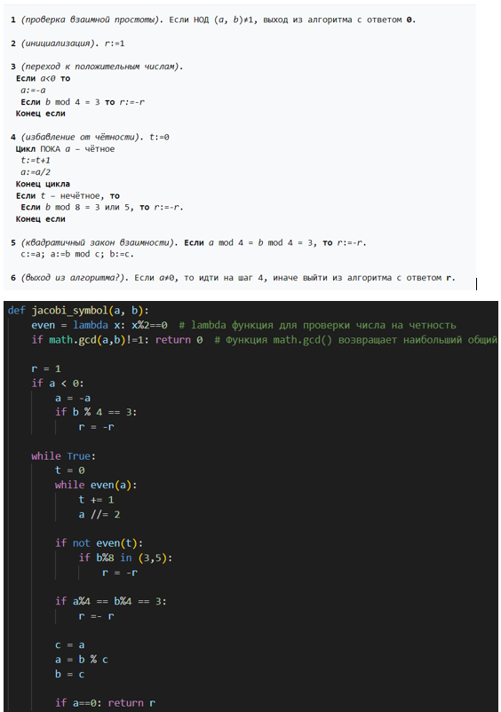
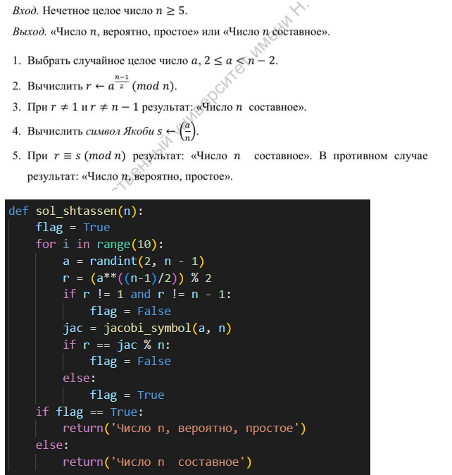
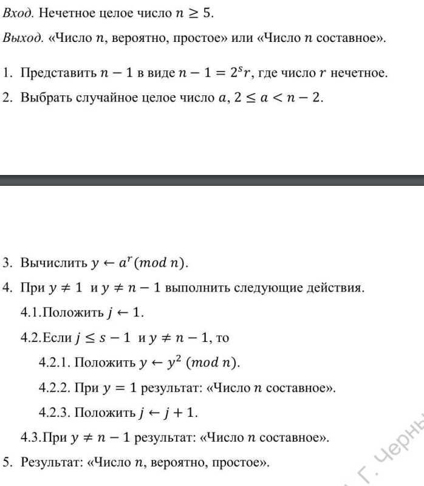
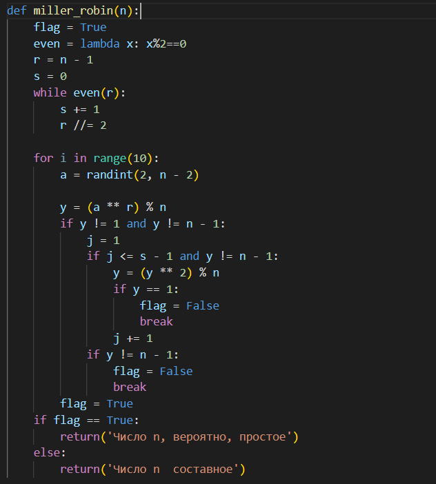

---
## Front matter
lang: ru-RU
title: "Лабораторная работа 5"
subtitle: "Вероятностные алгоритмы проверки чисел на простоту" 
author: "Пологов Владислав Александрович"
institute: RUDN University, Moscow, Russian Federation
date: 2022 Москва

## Formatting
mainfont: PT Serif
romanfont: PT Serif
sansfont: PT Serif
monofont: PT Serif
toc: false
slide_level: 2
theme: metropolis
header-includes: 
 - \metroset{progressbar=frametitle,sectionpage=progressbar,numbering=fraction}
 - '\makeatletter'
 - '\beamer@ignorenonframefalse'
 - '\makeatother'
aspectratio: 43
section-titles: true
---

# Цель работы 

## Цель работы

Реализовать алгоритмы проверки числа на простоту:

    1. Алгоритм, реализующий тест Ферма;
    2. Алгоритм вычисления символа Якоби;
    3. Алгоритм, реализующий тест Соловэя-Штрассена;
    4. Алгоритм, реализующий тест Миллера-Рабина.

# Описание реализации

## Описание реализации

Для реализации алгоритмов использовались средства языка Python. 

# Реализация 

## Алгоритм, реализующий тест Ферма

На вход мы подаём нечётное целое число n >= 5. На выходе получаем результат работы алгоритма и суждение о том, является ли число вероятно простым или составным.
Алгоиртм, реализующий тест Ферма и его реализация на Python приведёны на рисунке 1. (рис. -@fig:001)

## Алгоритм, реализующий тест Ферма

{ #fig:001 width=100% }

## Алгоритм вычисления символа Якоби

Для реализации алгоритма вычисления символа Якоби использовалась дополнительная переменная g.Символ Якоби практически никогда не вычисляют по определению. Чаще всего для вычисления используют свойства символа Якоби, главным образом — квадратичный закон взаимности.
Ключевое используемое при вычислении свойство символа Якоби — квадратичный закон взаимности. Благодаря ему алгоритм похож на алгоритм Евклида нахождения наибольшего общего делителя двух чисел, в котором тоже аргументы на каждом шаге меняются местами. Аналогично алгоритму Евклида, при перестановке аргументов больший заменяется на остаток от деления на меньший. Это возможно благодаря периодичности символа Якоби. Однако, поскольку символ Якоби определён только при условии нечётности второго аргумента, то до перестановки выделяется чётная часть первого аргумента.
Данный алгоритм и его реализация на Python представлены на рисунке 2. (рис. -@fig:002)

## Алгоритм вычисления символа Якоби

{ #fig:002 width=100% }

## Алгоритм, реализующий тест Соловэя-Штрассена

Для его вычисления понадобится вызывать функцию нахождения символа Якоби. На вход мы подаём нечётное целое число n >= 5. На выходе получаем результат работы алгоритма и суждение о том, является ли число вероятно простым или составным.
Алгоритм, реализующий тест Соловэя-Штрассена и его реализация на Python представлены на рисунке 3. (рис. -@fig:003)

## Алгоритм, реализующий тест Соловэя-Штрассена

{ #fig:003 width=100% }

## Алгоритм, реализующий тест Миллера-Рабина

На вход мы подаём нечётное целое число n >= 5. На выходе получаем результат работы алгоритма и суждение о том, является ли число вероятно простым или составным.

Алгоритм, реализующий тест Миллера-Рабина представлен на рисунке 4. (рис. -@fig:004)

Код алгоритма, реализующего тест Миллера-Рабина, представлен на рисунке 5. (рис. -@fig:005)

## Алгоритм, реализующий тест Миллера-Рабина

{ #fig:004 width=100% }

## Алгоритм, реализующий тест Миллера-Рабина

{ #fig:005 width=100% }

# Вывод 

## Вывод 

* Реализовали следующие алгоритмы для проверки чисел на простоту:
    1. Алгоритм, реализующий тест Ферма;
    2. Алгоритм вычисления символа Якоби;
    3. Алгоритм, реализующий тест Соловэя-Штрассена;
    4. Алгоритм, реализующий тест Миллера-Рабина.

## {.standout}