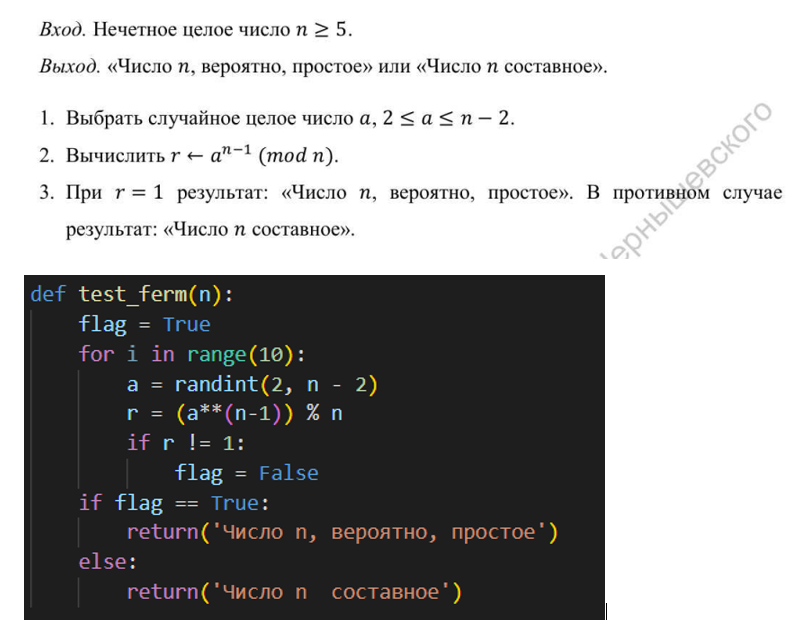
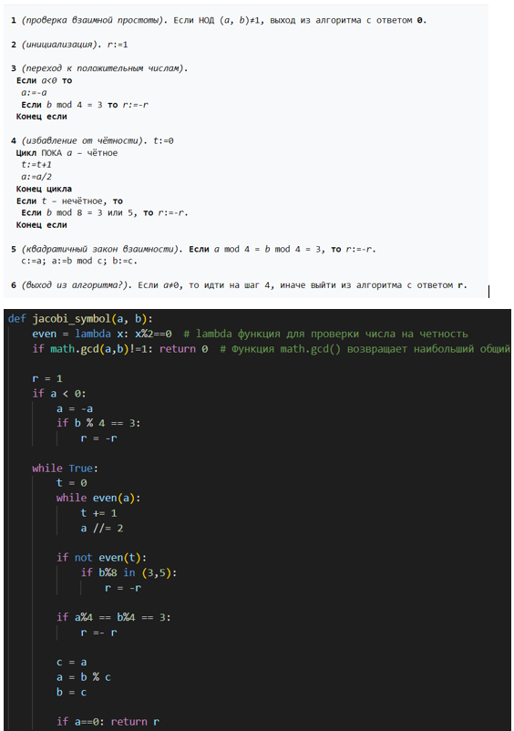
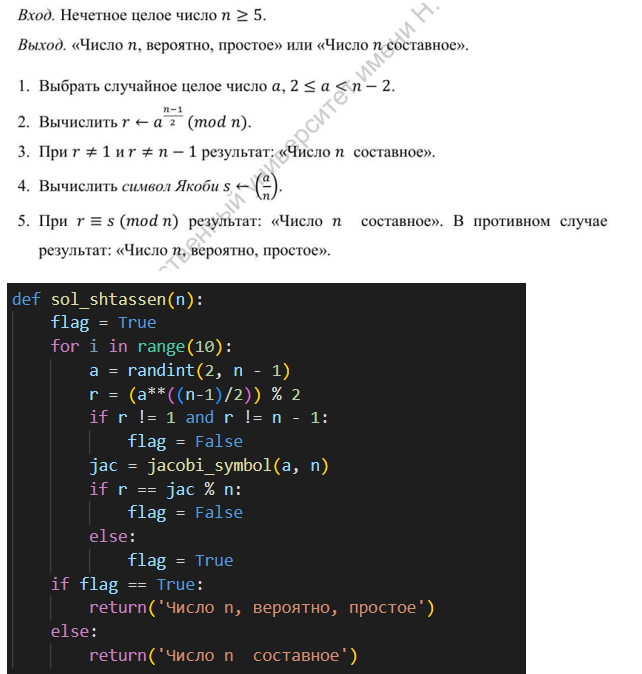
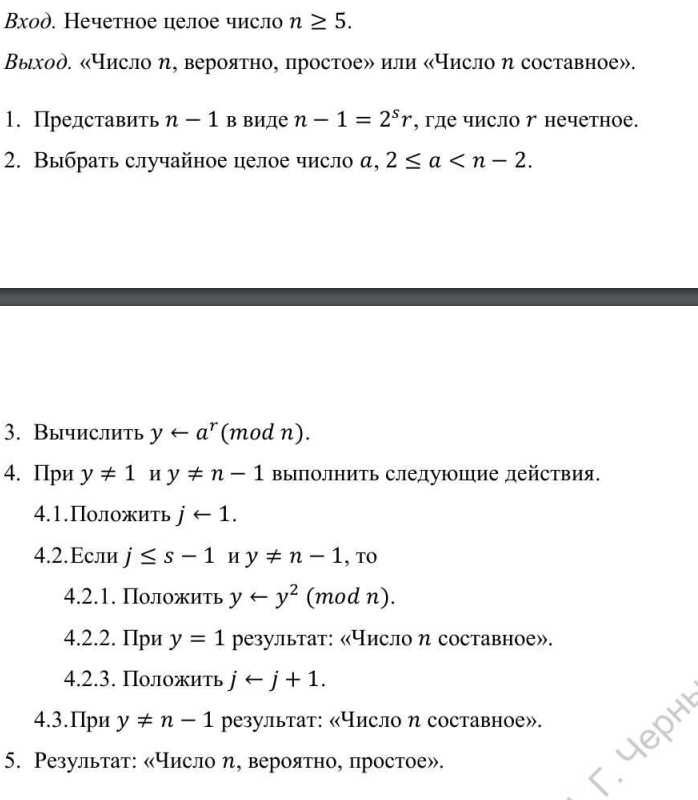
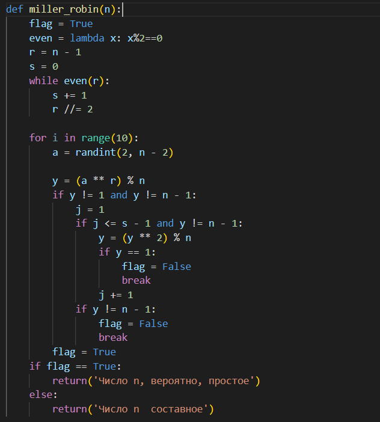

---
# Front matter
lang: ru-RU
title: "Лабораторная работа 5"
subtitle: "Вероятностные алгоритмы проверки чисел на простоту" 
author: "Пологов Владислав Александрович"

# Formatting
toc-title: "Содержание"
toc: true # Table of contents
toc_depth: 2
lof: true # List of figures
lot: false # List of tables
fontsize: 12pt
linestretch: 1.5
papersize: a4paper
documentclass: scrreprt
polyglossia-lang: russian
polyglossia-otherlangs: english
mainfont: PT Serif
romanfont: PT Serif
sansfont: PT Serif
monofont: PT Serif
mainfontoptions: Ligatures=TeX
romanfontoptions: Ligatures=TeX
sansfontoptions: Ligatures=TeX,Scale=MatchLowercase
monofontoptions: Scale=MatchLowercase
indent: true
pdf-engine: lualatex
header-includes:
  - \linepenalty=10 # the penalty added to the badness of each line within a paragraph (no associated penalty node) Increasing the value makes tex try to have fewer lines in the paragraph.
  - \interlinepenalty=0 # value of the penalty (node) added after each line of a paragraph.
  - \hyphenpenalty=50 # the penalty for line breaking at an automatically inserted hyphen
  - \exhyphenpenalty=50 # the penalty for line breaking at an explicit hyphen
  - \binoppenalty=700 # the penalty for breaking a line at a binary operator
  - \relpenalty=500 # the penalty for breaking a line at a relation
  - \clubpenalty=150 # extra penalty for breaking after first line of a paragraph
  - \widowpenalty=150 # extra penalty for breaking before last line of a paragraph
  - \displaywidowpenalty=50 # extra penalty for breaking before last line before a display math
  - \brokenpenalty=100 # extra penalty for page breaking after a hyphenated line
  - \predisplaypenalty=10000 # penalty for breaking before a display
  - \postdisplaypenalty=0 # penalty for breaking after a display
  - \floatingpenalty = 20000 # penalty for splitting an insertion (can only be split footnote in standard LaTeX)
  - \raggedbottom # or \flushbottom
  - \usepackage{float} # keep figures where there are in the text
  - \floatplacement{figure}{H} # keep figures where there are in the text
---

# Цель работы 

Реализовать алгоритмы проверки числа на простоту:

    1. Алгоритм, реализующий тест Ферма;
    2. Алгоритм вычисления символа Якоби;
    3. Алгоритм, реализующий тест Соловэя-Штрассена;
    4. Алгоритм, реализующий тест Миллера-Рабина.

# Описание реализации

Для реализации алгоритмов использовались средства языка Python. 

# Реализация 

## Алгоритм, реализующий тест Ферма

На вход мы подаём нечётное целое число n >= 5. На выходе получаем результат работы алгоритма и суждение о том, является ли число вероятно простым или составным.
Алгоиртм, реализующий тест Ферма и его реализация на Python приведёны на рисунке 1. (рис. -@fig:001)

## Алгоритм, реализующий тест Ферма

{ #fig:001 width=100% }

## Алгоритм вычисления символа Якоби

Для реализации алгоритма вычисления символа Якоби использовалась дополнительная переменная g.Символ Якоби практически никогда не вычисляют по определению. Чаще всего для вычисления используют свойства символа Якоби, главным образом — квадратичный закон взаимности.
Ключевое используемое при вычислении свойство символа Якоби — квадратичный закон взаимности. Благодаря ему алгоритм похож на алгоритм Евклида нахождения наибольшего общего делителя двух чисел, в котором тоже аргументы на каждом шаге меняются местами. Аналогично алгоритму Евклида, при перестановке аргументов больший заменяется на остаток от деления на меньший. Это возможно благодаря периодичности символа Якоби. Однако, поскольку символ Якоби определён только при условии нечётности второго аргумента, то до перестановки выделяется чётная часть первого аргумента.
Данный алгоритм и его реализация на Python представлены на рисунке 2. (рис. -@fig:002)

## Алгоритм вычисления символа Якоби

{ #fig:002 width=100% }

## Алгоритм, реализующий тест Соловэя-Штрассена

Для его вычисления понадобится вызывать функцию нахождения символа Якоби. На вход мы подаём нечётное целое число n >= 5. На выходе получаем результат работы алгоритма и суждение о том, является ли число вероятно простым или составным.
Алгоритм, реализующий тест Соловэя-Штрассена и его реализация на Python представлены на рисунке 3. (рис. -@fig:003)

## Алгоритм, реализующий тест Соловэя-Штрассена

{ #fig:003 width=100% }

## Алгоритм, реализующий тест Миллера-Рабина

На вход мы подаём нечётное целое число n >= 5. На выходе получаем результат работы алгоритма и суждение о том, является ли число вероятно простым или составным.

Алгоритм, реализующий тест Миллера-Рабина представлен на рисунке 4. (рис. -@fig:004)

Код алгоритма, реализующего тест Миллера-Рабина, представлен на рисунке 5. (рис. -@fig:005)

## Алгоритм, реализующий тест Миллера-Рабина

{ #fig:004 width=100% }

## Алгоритм, реализующий тест Миллера-Рабина

{ #fig:005 width=100% }

# Вывод 

* Реализовали следующие алгоритмы для проверки чисел на простоту:
    1. Алгоритм, реализующий тест Ферма;
    2. Алгоритм вычисления символа Якоби;
    3. Алгоритм, реализующий тест Соловэя-Штрассена;
    4. Алгоритм, реализующий тест Миллера-Рабина.