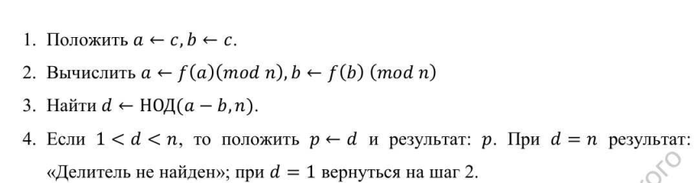
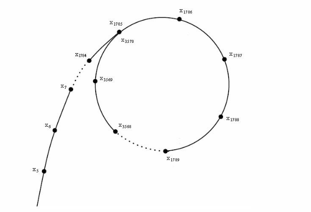
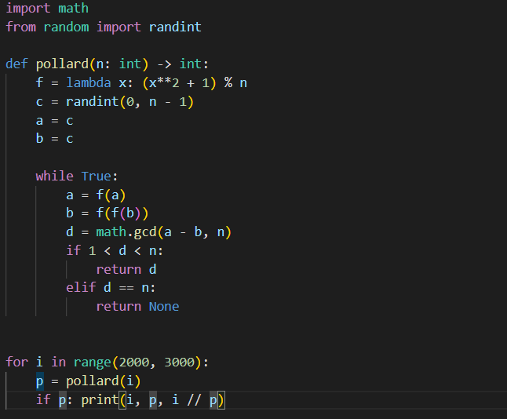

---
## Front matter
lang: ru-RU
title: "Лабораторная работа 6"
subtitle: "Разложение чисел на множители" 
author: "Пологов Владислав Александрович"
institute: RUDN University, Moscow, Russian Federation
date: 2022 Москва

## Formatting
mainfont: PT Serif
romanfont: PT Serif
sansfont: PT Serif
monofont: PT Serif
toc: false
slide_level: 2
theme: metropolis
header-includes: 
 - \metroset{progressbar=frametitle,sectionpage=progressbar,numbering=fraction}
 - '\makeatletter'
 - '\beamer@ignorenonframefalse'
 - '\makeatother'
aspectratio: 43
section-titles: true
---

# Цель работы 

## Цель работы

Реализовать алгоритм, реализующий р-метод Полларда

# Описание реализации

## Описание реализации

Для реализации алгоритмов использовались средства языка Python. 

# Реализация 

## Алгоритм, реализующий р-метод Полларда

Итак, мы хотим факторизовать число n. Предположим, что n = pq  и p ≈ q. Понятно, что труднее случая, наверное, нет. Алгоритм итеративно ищет наименьший делитель и таким образом сводит задачу к как минимум в два раза меньшей.
Алгоиртм, реализующий р-метод Полларда приведён на рисунке 1. (рис. -@fig:001)

## Алгоритм, реализующий р-метод Полларда

{ #fig:001 width=100% }

## Алгоритм, реализующий р-метод Полларда

Возьмём произвольную «достаточно случайную» с точки зрения теории чисел функцию. Например f(x) = (x + 1) ^2 mod n.

Граф, в котором из каждой вершины есть единственное ребро , называется функциональным. Если в нём нарисовать «траекторию» произвольного элемента — какой-то путь, превращающийся в цикл — то получится что-то похожее на букву (ро). Алгоритм из-за этого так и назван.
Траектория произвольного элемента представлена на рисунке 2. (рис. -@fig:002)

## Траектория произвольного элемента

{ #fig:002 width=100% }

## Код, реализующий алгоритм

Использовались библиотеки math для вычисления НОД и randint для получения целого рандомного числа.
Код, реализующий р-метод Полларда представлен на рисунке 3. (рис. -@fig:003)

## Код, реализующий алгоритм

{ #fig:003 width=100% }

# Вывод 

## Вывод 

* Реализован программно р-метод Полларда. Проведена проверка методом квадратов.

## {.standout}