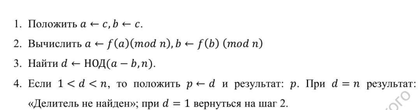
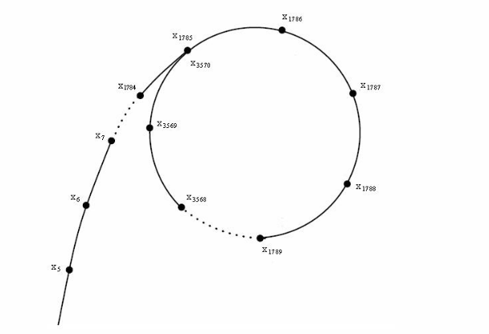
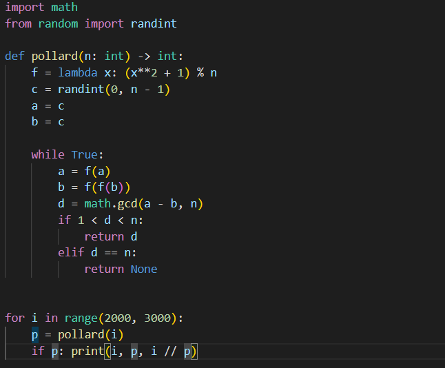

---
# Front matter
lang: ru-RU
title: "Лабораторная работа 6"
subtitle: "Разложение чисел на множители" 
author: "Пологов Владислав Александрович"

# Formatting
toc-title: "Содержание"
toc: true # Table of contents
toc_depth: 2
lof: true # List of figures
lot: false # List of tables
fontsize: 12pt
linestretch: 1.5
papersize: a4paper
documentclass: scrreprt
polyglossia-lang: russian
polyglossia-otherlangs: english
mainfont: PT Serif
romanfont: PT Serif
sansfont: PT Serif
monofont: PT Serif
mainfontoptions: Ligatures=TeX
romanfontoptions: Ligatures=TeX
sansfontoptions: Ligatures=TeX,Scale=MatchLowercase
monofontoptions: Scale=MatchLowercase
indent: true
pdf-engine: lualatex
header-includes:
  - \linepenalty=10 # the penalty added to the badness of each line within a paragraph (no associated penalty node) Increasing the value makes tex try to have fewer lines in the paragraph.
  - \interlinepenalty=0 # value of the penalty (node) added after each line of a paragraph.
  - \hyphenpenalty=50 # the penalty for line breaking at an automatically inserted hyphen
  - \exhyphenpenalty=50 # the penalty for line breaking at an explicit hyphen
  - \binoppenalty=700 # the penalty for breaking a line at a binary operator
  - \relpenalty=500 # the penalty for breaking a line at a relation
  - \clubpenalty=150 # extra penalty for breaking after first line of a paragraph
  - \widowpenalty=150 # extra penalty for breaking before last line of a paragraph
  - \displaywidowpenalty=50 # extra penalty for breaking before last line before a display math
  - \brokenpenalty=100 # extra penalty for page breaking after a hyphenated line
  - \predisplaypenalty=10000 # penalty for breaking before a display
  - \postdisplaypenalty=0 # penalty for breaking after a display
  - \floatingpenalty = 20000 # penalty for splitting an insertion (can only be split footnote in standard LaTeX)
  - \raggedbottom # or \flushbottom
  - \usepackage{float} # keep figures where there are in the text
  - \floatplacement{figure}{H} # keep figures where there are in the text
---

# Цель работы 

Реализовать алгоритм, реализующий р-метод Полларда

# Описание реализации

Для реализации алгоритмов использовались средства языка Python. 

# Реализация 

## Алгоритм, реализующий р-метод Полларда

Итак, мы хотим факторизовать число n. Предположим, что n = pq  и p ≈ q. Понятно, что труднее случая, наверное, нет. Алгоритм итеративно ищет наименьший делитель и таким образом сводит задачу к как минимум в два раза меньшей.
Алгоиртм, реализующий р-метод Полларда приведён на рисунке 1. (рис. -@fig:001)

## Алгоритм, реализующий р-метод Полларда

{ #fig:001 width=100% }

## Алгоритм, реализующий р-метод Полларда

Возьмём произвольную «достаточно случайную» с точки зрения теории чисел функцию. Например f(x) = (x + 1) ^2 mod n.

Граф, в котором из каждой вершины есть единственное ребро , называется функциональным. Если в нём нарисовать «траекторию» произвольного элемента — какой-то путь, превращающийся в цикл — то получится что-то похожее на букву (ро). Алгоритм из-за этого так и назван.
Траектория произвольного элемента представлена на рисунке 2. (рис. -@fig:002)

## Траектория произвольного элемента

{ #fig:002 width=100% }

## Код, реализующий алгоритм

Использовались библиотеки math для вычисления НОД и randint для получения целого рандомного числа.
Код, реализующий р-метод Полларда представлен на рисунке 3. (рис. -@fig:003)

## Код, реализующий алгоритм

{ #fig:003 width=100% }

# Вывод 

* Реализован программно р-метод Полларда. Проведена проверка методом квадратов.