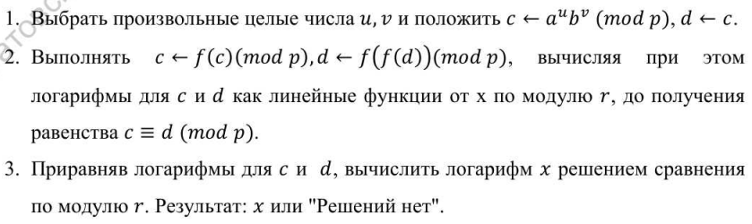
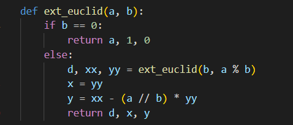
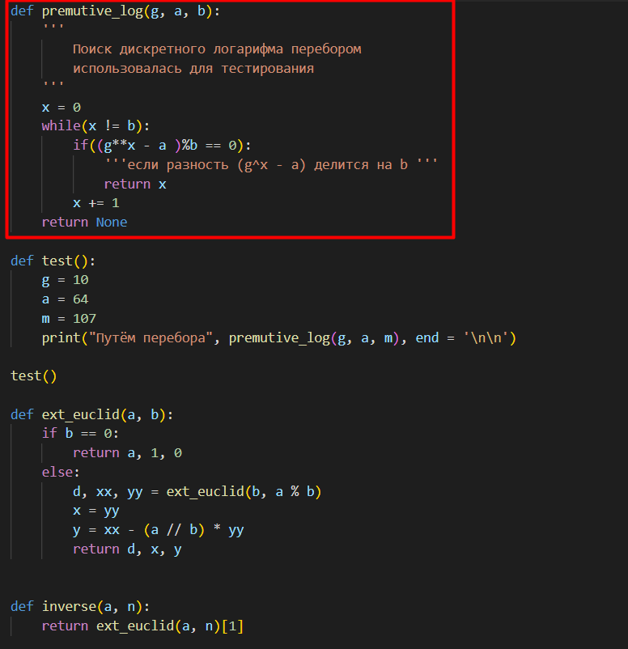
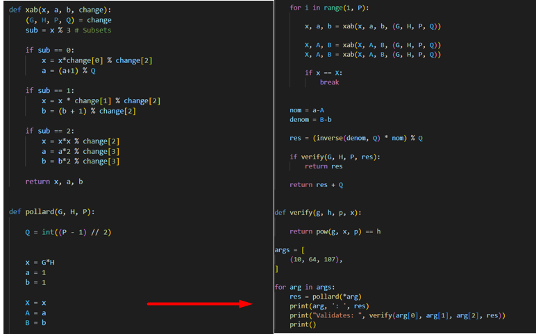

---
## Front matter
lang: ru-RU
title: "Лабораторная работа 7"
subtitle: "Дискретное логарифмирование в конечном поле" 
author: "Пологов Владислав Александрович"
institute: RUDN University, Moscow, Russian Federation
date: 2022 Москва

## Formatting
mainfont: PT Serif
romanfont: PT Serif
sansfont: PT Serif
monofont: PT Serif
toc: false
slide_level: 2
theme: metropolis
header-includes: 
 - \metroset{progressbar=frametitle,sectionpage=progressbar,numbering=fraction}
 - '\makeatletter'
 - '\beamer@ignorenonframefalse'
 - '\makeatother'
aspectratio: 43
section-titles: true
---

# Цель работы 

## Цель работы

Реализовать алгоритм, реализующий р-метод Полларда для задач дискретного логарифмирования

# Описание реализации

## Описание реализации

Для реализации алгоритмов использовались средства языка Python. 

# Реализация 

## Алгоритм, реализующий р-метод Полларда для задач дискретного логарифмирования

На вход  будет подаваться простое число р, число а порядка r по модулю p, целое число b, 1 < b < p; отображение f, обладающее сжимающими свойствами и сохраняющее вычислимость логарифма. На выходе должны получить показатель x, для которого a ^ x = b (mod p), если такой показатель существует. Алгоритм представлен на рисунке 1. (рис. -@fig:001)

## Алгоритм, реализующий р-метод Полларда

{ #fig:001 width=100% }

## Код, реализующий алгоритм

В начале использовалась функция, реазлизующая расширенный алгоритм Евклида, представленный на рисунке 2.(рис. -@fig:002)
Также применена функция, для нахождения логарифма методом перебора, испульзуема для проверки.(рис. -@fig:003)
Код, реализующий р-метод Полларда для задач дискретного логарифмирования представлен на рисунках 2, 3, 4. (рис. -@fig:004)

## Код, реализующий алгоритм ч.1

{ #fig:002 width=100% }

## Код, реализующий алгоритм ч.2

{ #fig:003 width=100% }

## Код, реализующий алгоритм ч.3

{ #fig:004 width=100% }

# Вывод 

## Вывод 

* Реализован программно р-метод Полларда для задач дискретного логарифмирования. Проведена проверка методом перебора.

## {.standout}