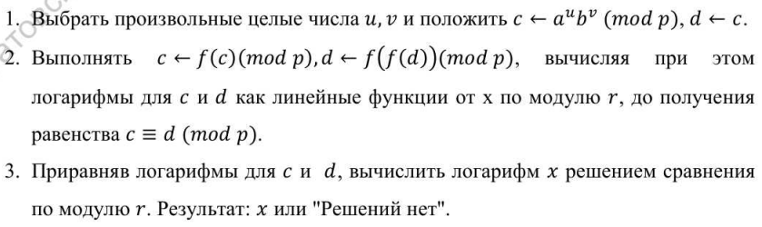
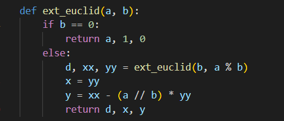
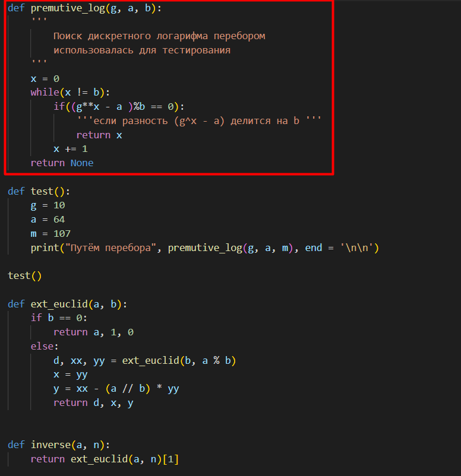
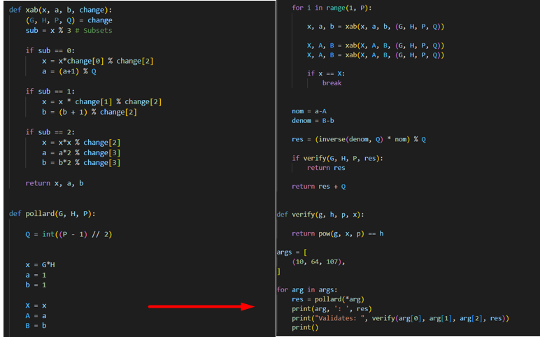

---
# Front matter
lang: ru-RU
title: "Лабораторная работа 7"
subtitle: "Дискретное логарифмирование в конечном поле" 
author: "Пологов Владислав Александрович"

# Formatting
toc-title: "Содержание"
toc: true # Table of contents
toc_depth: 2
lof: true # List of figures
lot: false # List of tables
fontsize: 12pt
linestretch: 1.5
papersize: a4paper
documentclass: scrreprt
polyglossia-lang: russian
polyglossia-otherlangs: english
mainfont: PT Serif
romanfont: PT Serif
sansfont: PT Serif
monofont: PT Serif
mainfontoptions: Ligatures=TeX
romanfontoptions: Ligatures=TeX
sansfontoptions: Ligatures=TeX,Scale=MatchLowercase
monofontoptions: Scale=MatchLowercase
indent: true
pdf-engine: lualatex
header-includes:
  - \linepenalty=10 # the penalty added to the badness of each line within a paragraph (no associated penalty node) Increasing the value makes tex try to have fewer lines in the paragraph.
  - \interlinepenalty=0 # value of the penalty (node) added after each line of a paragraph.
  - \hyphenpenalty=50 # the penalty for line breaking at an automatically inserted hyphen
  - \exhyphenpenalty=50 # the penalty for line breaking at an explicit hyphen
  - \binoppenalty=700 # the penalty for breaking a line at a binary operator
  - \relpenalty=500 # the penalty for breaking a line at a relation
  - \clubpenalty=150 # extra penalty for breaking after first line of a paragraph
  - \widowpenalty=150 # extra penalty for breaking before last line of a paragraph
  - \displaywidowpenalty=50 # extra penalty for breaking before last line before a display math
  - \brokenpenalty=100 # extra penalty for page breaking after a hyphenated line
  - \predisplaypenalty=10000 # penalty for breaking before a display
  - \postdisplaypenalty=0 # penalty for breaking after a display
  - \floatingpenalty = 20000 # penalty for splitting an insertion (can only be split footnote in standard LaTeX)
  - \raggedbottom # or \flushbottom
  - \usepackage{float} # keep figures where there are in the text
  - \floatplacement{figure}{H} # keep figures where there are in the text
---

# Цель работы 

## Цель работы

Реализовать алгоритм, реализующий р-метод Полларда для задач дискретного логарифмирования

# Описание реализации

## Описание реализации

Для реализации алгоритмов использовались средства языка Python. 

# Реализация 

## Алгоритм, реализующий р-метод Полларда для задач дискретного логарифмирования

На вход  будет подаваться простое число р, число а порядка r по модулю p, целое число b, 1 < b < p; отображение f, обладающее сжимающими свойствами и сохраняющее вычислимость логарифма. На выходе должны получить показатель x, для которого a ^ x = b (mod p), если такой показатель существует. Алгоритм представлен на рисунке 1. (рис. -@fig:001)

## Алгоритм, реализующий р-метод Полларда

{ #fig:001 width=100% }

## Код, реализующий алгоритм

В начале использовалась функция, реазлизующая расширенный алгоритм Евклида, представленный на рисунке 2.(рис. -@fig:002)
Также применена функция, для нахождения логарифма методом перебора, испульзуема для проверки.(рис. -@fig:003)
Код, реализующий р-метод Полларда для задач дискретного логарифмирования представлен на рисунках 2, 3, 4. (рис. -@fig:004)

## Код, реализующий алгоритм ч.1

{ #fig:002 width=100% }

## Код, реализующий алгоритм ч.2

{ #fig:003 width=100% }

## Код, реализующий алгоритм ч.3

{ #fig:004 width=100% }

# Вывод 

* Реализован программно р-метод Полларда для задач дискретного логарифмирования. Проведена проверка методом перебора.