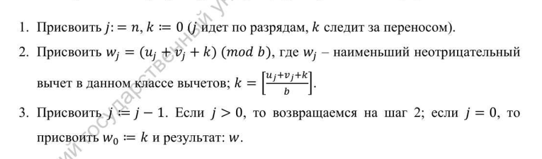
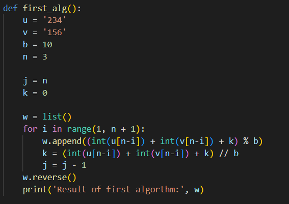
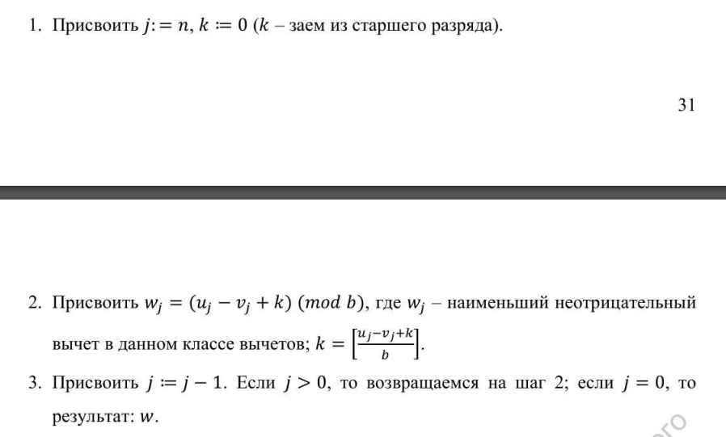
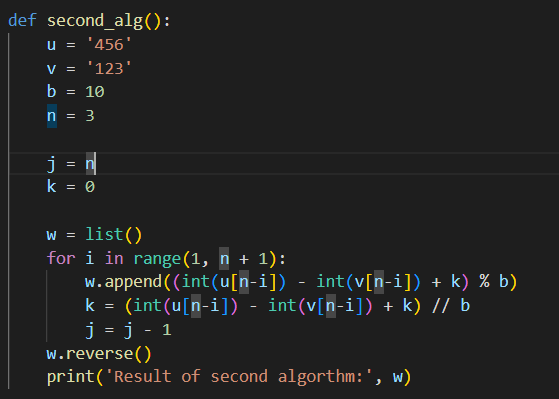
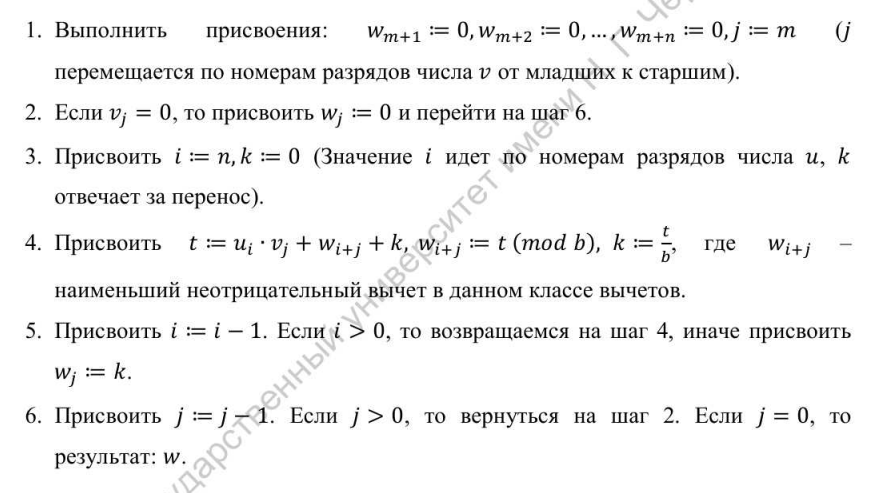
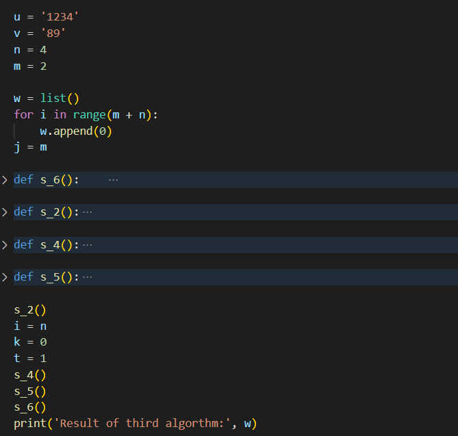
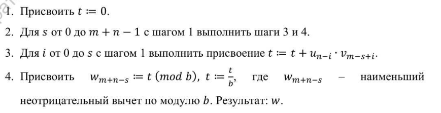
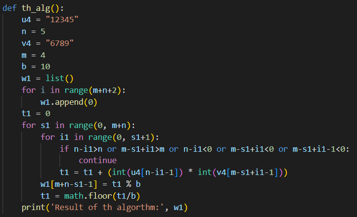
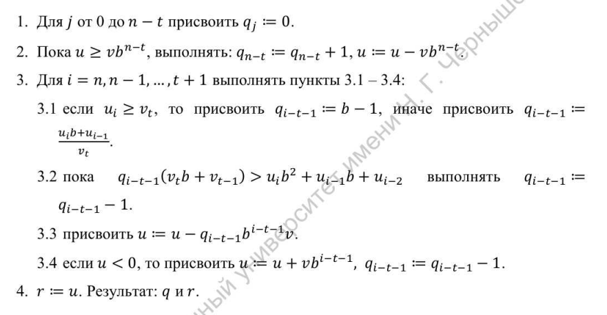
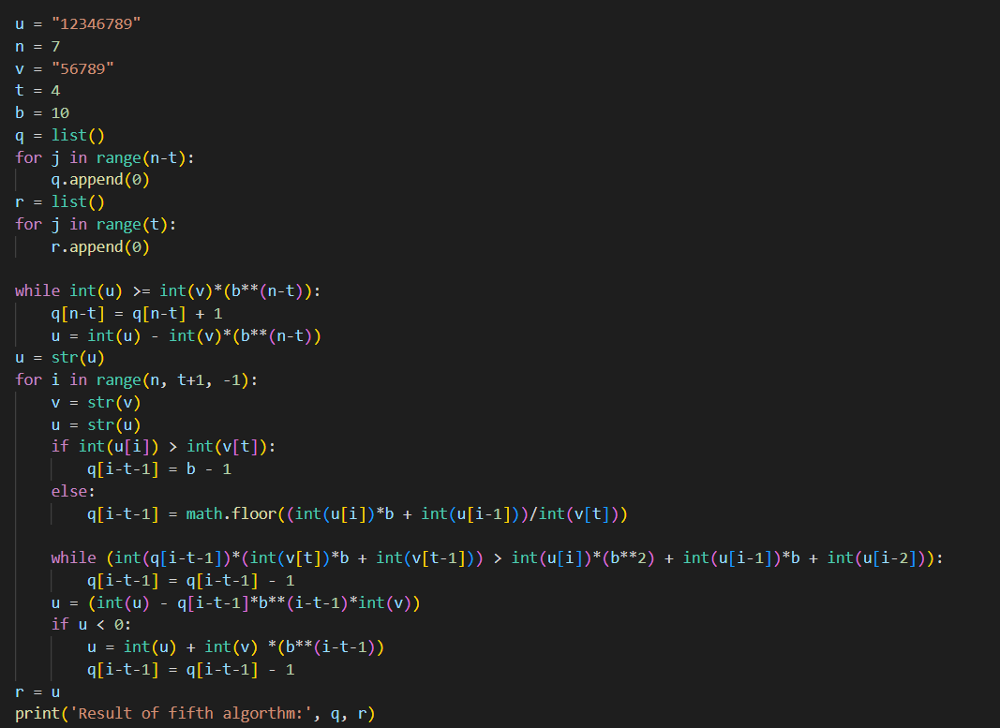

---
## Front matter
lang: ru-RU
title: "Лабораторная работа 8"
subtitle: "Целочисленная арифметика многократной точности" 
author: "Пологов Владислав Александрович"
institute: RUDN University, Moscow, Russian Federation
date: 2022 Москва

## Formatting
mainfont: PT Serif
romanfont: PT Serif
sansfont: PT Serif
monofont: PT Serif
toc: false
slide_level: 2
theme: metropolis
header-includes: 
 - \metroset{progressbar=frametitle,sectionpage=progressbar,numbering=fraction}
 - '\makeatletter'
 - '\beamer@ignorenonframefalse'
 - '\makeatother'
aspectratio: 43
section-titles: true
---

# Цель работы 

## Цель работы

Реализовать программно следующие алгоритмы:

    1. Сложение неотрицательных целых чисел;
    2. Вычитание неотрицательных целых чисел;
    3. Умножение неотрицательных целых чисел столбиком;
    4. Быстрый столбки;
    5. Деление многоразрядных целых чисел.

# Описание реализации

## Описание реализации

Для реализации алгоритмов использовались средства языка Python. 

# Реализация 

## Алгоритм, реализующий сложение неотрицательных целых чисел

На вход  будут подаваться два неотрицательных числа u и v разрядностью n с основанием системы счисления b. На выходе получим сумму w = w_0 w_1 w_2..., w_0 - цифра переноса, которая всегда равна 0 либо 1. Алгоритм представлен на рисунке 1. (рис. -@fig:001)
Код, реализующий данный алгоритм, представлен на рисунке 2. (рис. -@fig:002)

## Алгоритм, реализующий сложение неотрицательных целых чисел

{ #fig:001 width=100% }

## Код, реализующий алгоритм сложения неотрицательных целых чисел

{ #fig:002 width=100% }

## Алгоритм, реализующий вычитание неотрицательных целых чисел

На вход  будут подаваться два неотрицательных числа u и v разрядностью n с основанием системы счисления b. На выходе получим разность w = w_0 w_1 w_2... = u - v. Алгоритм представлен на рисунке 3. (рис. -@fig:003)
Код, реализующий данный алгоритм, представлен на рисунке 4. (рис. -@fig:004)

## Алгоритм, реализующий вычитание неотрицательных целых чисел

{ #fig:003 width=100% }

## Код, реализующий алгоритм вычитания неотрицательных целых чисел

{ #fig:004 width=100% }

## Алгоритм, реализующий умножение неотрицательных целых чисел столбиком

На вход  будут подаваться два неотрицательных числа u и v с основанием системы счисления b. На выходе получим произведение w = w_0 w_1 w_2... = u * v. Алгоритм представлен на рисунке 5. (рис. -@fig:005)
Код, реализующий данный алгоритм, представлен на рисунке 6. (рис. -@fig:006)

## Алгоритм, реализующий умножение неотрицательных целых чисел столбиком

{ #fig:005 width=100% }

## Код, реализующий алгоритм умножения неотрицательных целых чисел столбиком

{ #fig:006 width=100% }

## Алгоритм быстрый столбик

На вход  будут подаваться два неотрицательных числа u и v с основанием системы счисления b. На выходе получим произведение w = w_0 w_1 w_2... = u * v. Алгоритм представлен на рисунке 7. (рис. -@fig:007)
Код, реализующий данный алгоритм, представлен на рисунке 8. (рис. -@fig:008)

## Алгоритм быстрый столбик

{ #fig:007 width=100% }

## Код, реализующий алгоритм быстрый столбик

{ #fig:008 width=100% }

## Алгоритм деления многоразрядных целых чисел

На вход  будут подаваться два неотрицательных числа u и v разрядностью n и t соответственно. На выходе получим частное q и остаток r. Алгоритм представлен на рисунке 9. (рис. -@fig:009)
Код, реализующий данный алгоритм, представлен на рисунке 10. (рис. -@fig:010)

## Алгоритм деления многоразрядных целых чисел

{ #fig:009 width=100% }

## Код, реализующий алгоритм деления многоразрядных целых чисел

{ #fig:010 width=100% }

# Вывод 

## Вывод 

* Реализованы следующие алгоритмы:
    1. Сложение неотрицательных целых чисел;
    2. Вычитание неотрицательных целых чисел;
    3. Умножение неотрицательных целых чисел столбиком;
    4. Быстрый столбки;
    5. Деление многоразрядных целых чисел.

## {.standout}